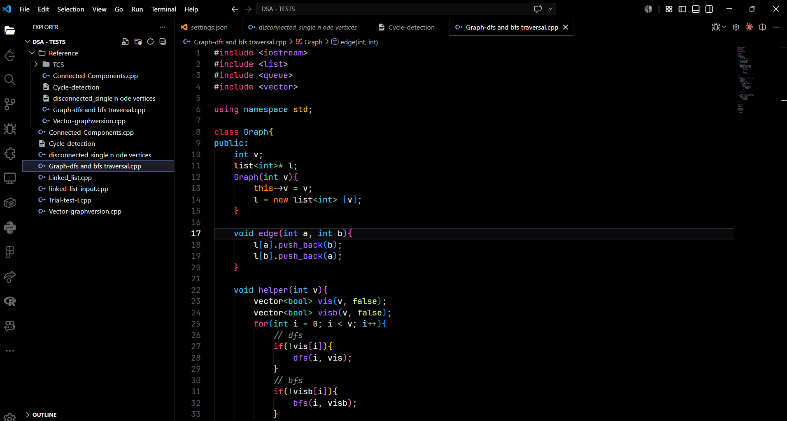

# Shinobi Black

A premium OLED black VS Code theme with vibrant syntax highlighting, handcrafted for long coding sessions.

<p align="center">
  
</p>

> [!TIP]
> **Recommended Font Setup:** To get the exact look shown in the preview image above, we recommend using the **JetBrains Mono** font with **Font Ligatures** enabled.

---

## Features

- 🖤 **Pure OLED Black** — True `#000000` background for maximum contrast and battery savings on OLED screens
- 💖 **Pink Keywords** — Control flow and storage keywords in vibrant pink
- 💙 **Cyan Types** — Classes, structs, interfaces, enums, and primitives in striking cyan
- 💜 **Purple Functions & Strings** — Function calls and string literals in bold purple
- 💛 **Gold Numbers & Constants** — Numerics, user constants, and annotations in warm gold
- 🌿 **Green Booleans** — Booleans, `null`, `nullptr`, and language constants in fresh green
- 🍊 **Orange `this`/`self`** — Language variables highlighted in orange for quick identification
- 🩶 **Calm Comments** — Muted gray italic comments that stay out of the way
- 🔵 **Cyan Operators** — Distinct operator coloring for visual clarity
- ⚪ **Clean Variables** — Variables and parameters in soft white for readability

## Language Support

Optimized syntax highlighting for:

| Language   | Scopes Covered |
|------------|----------------|
| C / C++    | Keywords, types, functions, preprocessor, macros, templates, labels |
| Python     | Keywords, decorators, f-strings, magic methods, self |
| Java       | Keywords, annotations, types, packages |
| JavaScript | Keywords, template literals, regex, JSX |
| TypeScript | Keywords, interfaces, type aliases, enums, generics, TSX |
| HTML       | Tags, attributes, entities |
| CSS / SCSS | Properties, selectors, values, variables, functions |
| JSON       | Keys, string values |
| Markdown   | Headings, bold, italic, links, code, quotes, lists |
| SQL        | DML/DDL keywords, aggregate functions, types |

## Workbench Coverage

Every visible UI surface is themed with the OLED black aesthetic:

- Activity Bar & Badges
- Side Bar & Explorer
- Editor Tabs & Groups
- Title Bar
- Status Bar (including debugging & remote)
- Panel (Terminal, Output, Problems)
- Terminal (full ANSI color palette)
- Breadcrumbs
- Input, Dropdown, Buttons
- Scrollbar & Minimap
- Peek View
- Notifications
- Command Palette
- Git Decorations
- Diff & Merge Editor
- Debug Toolbar

## Installation

### From VSIX

```bash
code --install-extension shinobi-black-theme-1.0.0.vsix
```

### Activate

1. Open **Command Palette** (`Ctrl+Shift+P` / `Cmd+Shift+P`)
2. Search for **Preferences: Color Theme**
3. Select **Shinobi Black**

## Color Palette

| Role         | Hex       | Preview |
|--------------|-----------|---------|
| Background   | `#000000` | ⬛ |
| Foreground   | `#EAEAEA` | ⬜ |
| Keywords     | `#F14E95` | 🩷 |
| Types        | `#4BC6F7` | 🩵 |
| Functions    | `#B277FA` | 💜 |
| Strings      | `#B277FA` | 💜 |
| Numbers      | `#FFCB6B` | 💛 |
| Comments     | `#8B949E` | 🩶 |
| Variables    | `#EAEAEA` | ⬜ |
| Operators    | `#89DDFF` | 🔵 |
| Punctuation  | `#C8C8C8` | ⚪ |
| Booleans     | `#C3E88D` | 💚 |
| this/self    | `#FFA500` | 🟠 |
| Errors       | `#FF5370` | ❤️ |
| Escape Chars | `#89DDFF` | 🔵 |
| Preprocessor | `#FF5370` | ❤️ |
| Annotations  | `#FFCB6B` | 💛 |

## License

[MIT](LICENSE)

---

Made with ❤️ by Sanjay Baskar.